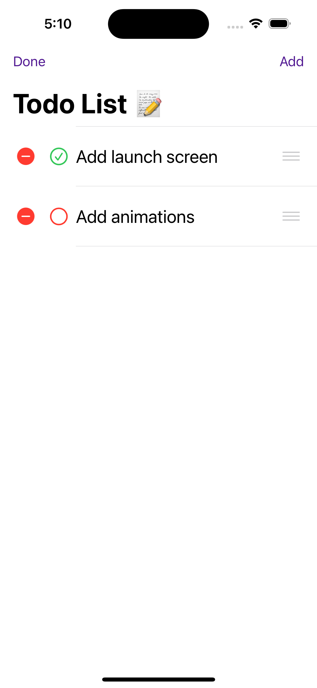
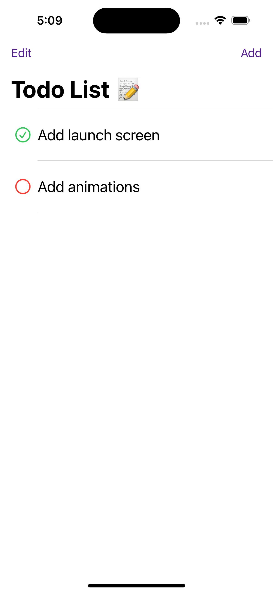
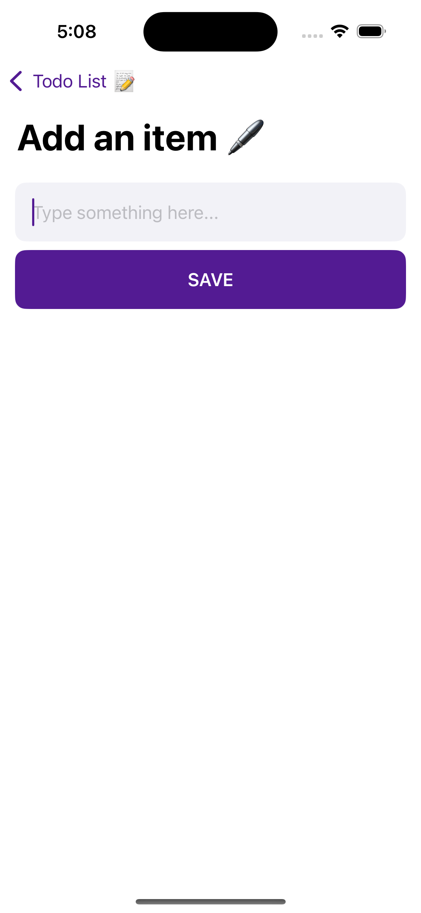
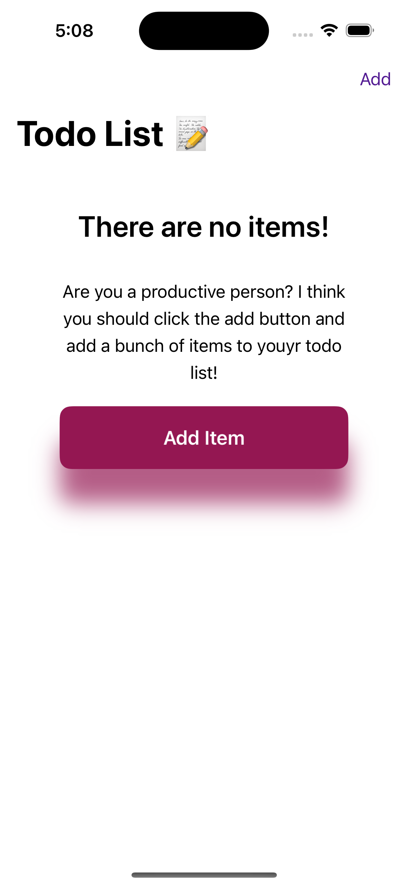

# ToDo App

## About the App
The **ToDo App** is a simple, user-friendly task management application built using **SwiftUI**. It allows users to easily add, edit, delete, and reorder their tasks. The app uses **UserDefaults** to store tasks locally, ensuring your data persists even after the app is closed.

## Features
- ➕ Add new ToDo items
- 📝 Edit (Modify) existing ToDos
- 🗑️ Delete ToDos
- 🔀 Reorder (Move) ToDos by dragging
- 💾 Persistent storage using **UserDefaults**

## Screenshots

  
  
  
  

*(Screenshots are inside the `AppImages/` folder.)*

## Technologies Used
- SwiftUI
- UserDefaults (for local data storage)

## How to Run
1. Clone the repository.
2. Open the `.xcodeproj` file with Xcode.
3. Build and run on the iOS Simulator or a real device.

---
